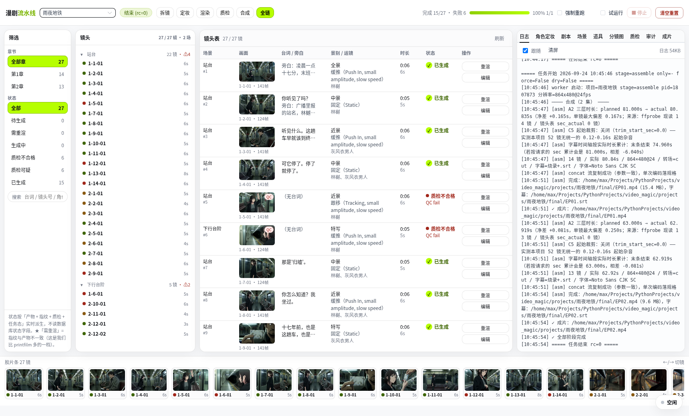
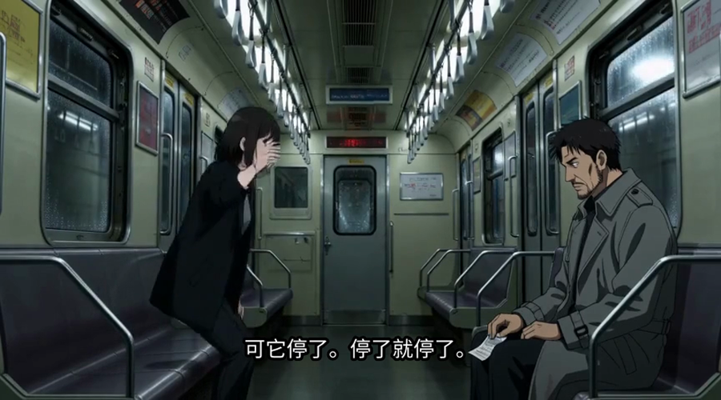
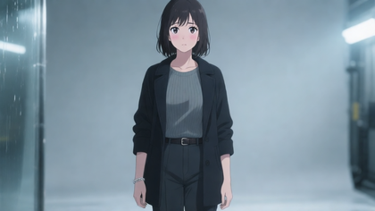

# 漫剧流水线 · video_magic

> 把小说章节丢进去，出来一部带配音和中文字幕的漫剧成片。
> **每一步都能看、能改、能重来** —— 不是抽卡式的一键黑盒。



---

## 它出来的是什么



*《雨夜地铁》成片截帧 —— 末班地铁停在不该停的站台，冷青色调、湿反光地面。*

一部 27 镜的悬疑短片，2 分 40 秒，角色有原生中文配音、烧好字幕、镜头之间用同一套
场景锚定和同一个角色的参考图。左右两栏里能看到它是怎么一步步做出来的。

---

## 它怎么做的

```
小说章节.md
     │
     ① 拆镜    DeepSeek 读整章，拆成镜头表
     │         每镜：谁 / 在哪 / 做什么 / 说什么 / 几秒 / 什么运镜 / 戏剧张力几分
     │
     ② 定妆    每个角色出一张参考图，同一角色抽 2 张供你挑
     │
     ③ 渲染    逐镜出视频，参考图注入保证"还是同一个人"
     │
     ④ 质检    机械判定：尾帧有没有冻结、时长对不对、字幕与画面同不同步
     │
     ⑤ 合成    按镜头表拼接 + 烧中文字幕 + 逐章出一集
     │
     ▼
final/EP01.mp4
```

全程 **零人工描线、零剪辑软件**，但每个环节的中间产物都摆在界面上。

---

## 它能控制到什么程度

这是它和"一键生成"最大的区别：**所有影响画面的东西都能改，改完只有相关镜头重做。**

| 你能改 | 在哪改 | 效果 |
|---|---|---|
| **每镜的提示词** | 镜头表 → 编辑 | 六段式（主体/动作/运镜/光影/音景/配乐），改完该镜变「需重渲」 |
| **角色长什么样** | 角色定妆 tab | 改定妆提示词，或**上传你自己的图** |
| **角色的服装变体** | 角色定妆 tab | 同一角色可有多套服装，按镜切换 |
| **场景是什么样** | 场景 tab | 改场景描述（它会逐字注入该场景每一镜），或传自己的概念图 |
| **道具长什么样** | 道具 tab | 同上 |
| **画面风格** | `project.json` | `realistic` 写实电影感 / `cg` 半写实 3D 建模 / `anime` 日式二维动画 |



*角色定妆照 —— 它决定这个角色在**每一个**镜头里的长相。不满意可以抽卡、可以自己传图。*

### 抽卡不卡手

定妆、场景概念图、道具图都是**抽卡制**：点一下**入队**，立刻能点下一个，
右下角队列面板随时看进度。**不用等，也不用盯着。**

---

## 为什么不一样：不压缩

大多数开源方案栽在同一件事上 —— 把小说先压成梗概再生成，**原文第一步就丢了**：
台词被改写、情节被合并、角色前后不是一个人。

这个项目的全部纪律都围绕"不压缩"：

| 纪律 | 怎么落地的 |
|---|---|
| **台词一句都不能丢** | 拆镜规范硬性要求；剧本层**逐句回原文核对**，找不到就报错 |
| **同一地点必须是同一个景** | 先抽出「场景实体」，同场景的镜头逐字注入同一段描述 |
| **同一角色跨镜要像同一个人** | 参考图 + 角色卡锁外貌，拆镜时**禁止**重写外貌 |
| **不让模型猜** | 生成提示词时逐项交代姿态/构图/服装/配饰/光位/色调/景深 |

第三条和第四条是踩出来的。比如"不让模型猜"这条规范里的话：

> 没写的维度模型会取训练集的**平均值**，而平均值就是**平光、糊背景、塑料脸**。
> 每写一个形容词，问自己：能不能换成可执行的名词？

---

## 界面上还有什么


- **分段进度条**：每一段宽度 ∝ 该镜实际时长，颜色标质检状态。
  它同时是进度条、时长分布图、和点击跳转的导航。
- **胶片条**：通览全片，缺哪段一眼看到。
- **质检 tab**：硬故障的镜头**默认不会进成片**，会被列出来让你决定重渲还是忽略。
- **成本护栏**：渲染前告诉你"这一步要花 22 分钟 GPU / 8500 tokens"，
  超预算时**暂停等你批准**，而不是跑完才发现花超了。
- **清空重置**：按「只清视频 / 清镜头表之后 / 全部清空」三档重来，
  清之前摆出完整清单、要求手输项目名、自动备份拆镜结果。

---

## 开始用

```bash
git clone <repo> && cd video_magic
cd web && npm install && npm run build:only && cd ..

mkdir -p projects/我的剧/novel
cp 第一章.md projects/我的剧/novel/
python3 pipeline.py 我的剧 --serve --port 8801
# → http://127.0.0.1:8801/   点「全链」
```

**前置**：ComfyUI 常驻运行（默认 `127.0.0.1:8188`，本项目不会启停它）、
ffmpeg、Python 3.10+、Node 18+、DeepSeek API key
（`DEEPSEEK_API_KEY` 或 `~/.config/video_magic/deepseek_key`）。
所需模型清单见下方「技术细节」。

---

## 花多少钱、多长时间

本机实测，不是估算：

| | |
|---|---|
| 一镜视频（864×480） | **约 42 秒** |
| 一张定妆照 | **约 5 秒** |
| 一次拆镜（一章） | **约 1700 tokens** |
| **52 镜的整片** | **约 36 分钟 GPU** |

所以一部片子的主要成本是渲染，而渲染时间只跟**镜头数**有关。
这也是为什么拆镜规范里写着"约每 90 字一镜，**绝不要把每句对白单独成镜**"——
那样会把 1745 字拆成 48 镜，片子碎成幻灯片、渲染时间翻倍。

---

## 技术细节

<details>
<summary>环境要求与模型清单</summary>

| 依赖 | 版本 |
|---|---|
| ComfyUI | 0.3.x |
| Python | 3.10+（**零第三方依赖**，纯标准库） |
| Node.js | 18+（只用于构建前端） |
| ffmpeg / ffprobe | 任意较新版 |

```
models/diffusion_models/  MiniMax-H3 相关权重          # 视频
models/diffusion_models/  qwen_image_nvfp4.safetensors # 定妆/场景/道具/分镜图
models/text_encoders/     qwen_2.5_vl_7b_nvfp4.safetensors
models/vae/               qwen_image_vae.safetensors
```

</details>

<details>
<summary>项目结构</summary>

```
pipeline.py          阶段入口
vm/
  plan.py            ① 拆镜：章节 → 镜头表 + 角色卡 + 场景 + 道具 + 风格句
  chars.py           ② 定妆 + 抽卡
  gen.py             ③ 逐镜渲染
  qc.py              ④ 质检
  assemble.py        ⑤ 合成 + 字幕
  script.py          剧本视图（由镜头表推导，零 token）+ 台词无损校验
  storyboard.py      分镜图
  qi.py / style.py   Qwen-Image 客户端 / 画面风格预设
  budget.py          成本护栏 + 台账
  queue.py           作业队列
  wsclient.py        极简 WebSocket 客户端（读 ComfyUI 步级进度）
  state.py           指纹、manifest、锁定
  taskctl.py         任务模型：锁、日志、进度、停止
  web.py             HTTP API + 前端托管
  audit/             节奏 / 台词覆盖 / 台词保真 / 完备性矩阵
web/                 Vue 3 + Vite + Element Plus 控制台
docs/prompts/        发给 LLM 的全部提示词
projects/            你的片子（**不提交**）
```

</details>

<details>
<summary>命令行工具</summary>

```bash
python3 -m vm.script     我的剧        # 剧本视图 + 台词无损校验
python3 -m vm.assets     我的剧 --list # 场景/道具概念图候选
python3 -m vm.assets     我的剧 --kind scene --id S1 --n 2          # 抽卡
python3 -m vm.assets     我的剧 --kind prop --id P1 --upload a.png  # 传自己的图
python3 -m vm.budget     我的剧 --stage render                      # 成本估算
python3 -m vm.storyboard 我的剧 --list                              # 分镜图状态
python3 -m vm.audit.cli  我的剧                                     # 节奏/台词覆盖审计
```

</details>

<details>
<summary>关键机制</summary>

**镜头指纹**：`md5(prompt, chars, refs, unet, lora, steps, w, h, frames, seed)` → 三态
`missing / stale / current`。改了任何影响画面的输入，**只有相关镜头**变「需重渲」。

**渲染检查点**：提交前先把 `prompt_id` 落盘，崩溃后从 `/history` 回收，
不重复烧 GPU。

**帧数网格**：H3 要求 `frames = 17k + 5`，本机上限 362 帧（15.08 秒/镜）。

</details>

<details>
<summary>测试</summary>

```bash
cd web && node ui-e2e.mjs          # 真浏览器 E2E（Playwright + Chromium）
FAST=1 node ui-e2e.mjs             # 冒烟
python3 -m unittest discover -s vm/audit/tests -q   # 审计层 66 项
```

E2E 用**真浏览器**而非 DOM 桩 —— `vue-tsc` 和 `vite build` 全绿但界面不显示的情况，
本项目遇到过多次。

</details>

---

## 已知局限

- **画面风格由参考图决定，文字控不住画风。** 想要二次元或建模风，必须让定妆照本身
  是那个风格 —— 改提示词里的风格句没用。这是实测出来的（同一提示词，只换参考图，
  整张图的画风跟着变）。
- **分镜图与成片构图不保证一致**（两个不同模型出的）。
- **连续性（跨镜动作衔接）未做。** 实测观感可接受，暂不投入。
- **单镜上限 20.75 秒**（受帧数网格限制）。
- 单项目同时只允许一个任务；抽卡类走队列，不并行。
